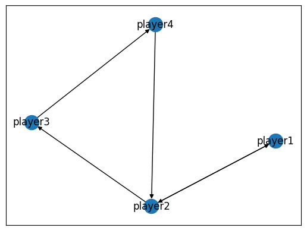
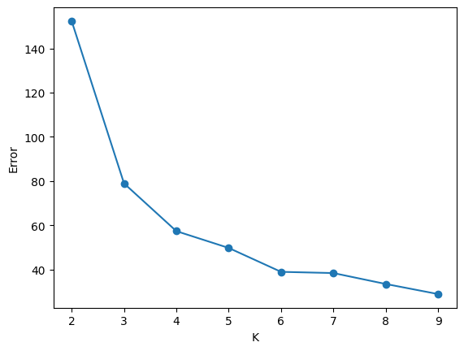

## PySpark

Apache Spark is another popular cluster computing framework for big data processing. Contrary to Hadoop, it takes advantage of high-RAM computing machines, which are now available. Spark processes data in memory on the distributed network instead of storing data in the filesystem. This can improve the processing time. Spark's advantages are natively supporting programming languages like Scala, Java, Python, and R. Spark has a direct Python interface - **pyspark**, which uses the same analogy of map and reduce. It can be used interactively from the command shell or jupyter notebook. Spark can query SQL databases directly, and DataFrame API is similar to pandas. 

Installation of pyspark requires installed Java. From there, we can install pyspark as any other python package and test our scrips locally before moving to the Spark cluster. 

```
pip install pyspark
```
Before we introduce the main features of the pyspark, let's see how we can write the simplest problem word count.

**Word Count in PySpark**


```python title="word_count_spark.py"
from pyspark import SparkContext

def main():
  sc = SparkContext(appName='SparkWordCount')
  input_file = sc.textFile('pg2701.txt')
  counts = input_file.flatMap(lambda line: line.split()) \
  .map(lambda word: (word, 1)) \
  .reduceByKey(lambda a, b: a + b)
  counts.saveAsTextFile('output')
  sc.stop()

if __name__ == '__main__':
  main()

```
The code can be run with  ```spark-submit word_count_spark.py``` 
the output will appear in folder output/0001 and output/0002, depending on the number of processes.

The ```sc = SparkContext(appName='SparkWordCount')``` creates a context object, which tells Spark how to access the cluster. 
The ```input_file = sc.textFile('pg2701.txt')``` loads data. 
The third line performs multiple input data transformations, similar to before. Everything is automatically parallelized and runs across multiple nodes. This file is not loaded; the variable lines are just a pointer to the external source. The second statement transforms the base RDD using the map() function to calculate the number of characters in each line. The variable line_lengths is not immediately computed due to the laziness of transformations. Finally, the reduce() method is called an action. At this point, Spark divides the computations into tasks on separate machines. Each machine runs the map and reduction on its local data, returning only the results to the driver program. With the lambda function, we can easily pass the function that has to be run on the cluster. 

**Resilient Distributed Datasets (RDDs)**

RDDs are immutable collections of data distributed across machines, which enables operations to be performed in parallel. They can be created from collections by calling  ```parallelize()``` method:

```python
data = [1, 2, 3, 4, 5, 6]
rdd = sc.parallelize(data)
rdd.glom().collect()
```
RDD.glom() returns a list of elements within each partition, while RDD.collect() collect all elements to the driver node. 
To specify the number of partitions:
```
rdd = sc.parallelize(data, 4)
rdd.glom().collect()
```

Another way to create Rdd is from a file using ```textFile()``` method, as we did in the word count example. 
 

**RDD Operations**

Here are listed some commonly used operations that can be applied to the RDDs: 

- map() map. function returns a RDD by applying function to each element of the source RDD


```python 
data = [1, 2, 3, 4, 5, 6]
rdd = sc.parallelize(data)
map_result = rdd.map(lambda x: x * 2)
map_result.collect()
```
[2, 4, 6, 8, 10, 12]

- flatMap() returns a flattened version of results. 

```python
data = [1, 2, 3, 4]
rdd = sc.parallelize(data)
rdd.map(lambda x: [x, pow(x,2)]).collect()

```
[[1, 1], [2, 4], [3, 9], [4, 16]]``

```python
rdd = sc.parallelize([1, 2, 3, 4])
rdd.flatMap(lambda x: [x, pow(x,2)]).collect()
```
[1, 1, 2, 4, 3, 9, 4, 16]


- .groupBy()

``` python
rdd = sc.parallelize(["apple", "banana", "cantaloupe"])
xs = rdd.groupBy(lambda x: x[0]).collect()
print(sorted([(x, sorted(y)) for (x, y) in xs]))
```
[('a', ['apple']), ('b', ['banana']), ('c', ['cantaloupe'])]

- .groupByKey() python
  
```
rdd = sc.parallelize([("pet", "dog"), ("pet", "cat"),("farm", "horse"), ("farm", "cow")])
xs = rdd.groupByKey().collect()

[(x, list(y)) for (x, y) in xs]
```
[('farm', ['horse', 'cow']), ('pet', ['dog', 'cat'])]

- filter(func) returns a new RDD contains only elements that function return as true

```python
rdd = sc.parallelize([1, 2, 3, 4, 5, 6])
rdd.filter(lambda x: x % 2 == 0).collect()
```
[2, 4, 6]

- distinct. this returns unique elements in the list

```
rdd = sc.parallelize([1, 2, 3, 2, 4, 1])
rdd.distinct().collect()
[4, 1, 2, 3]
```

- reduce

```py
rdd = sc.parallelize([1, 2, 3])
print(rdd.reduce(lambda a, b: a+b))
```
6

- reduceByKey

```py
rdd = sc.parallelize([(1, 2), (1, 5), (2, 4)])
rdd.reduceByKey(lambda a, b: a+b).collect()
```
[(1, 7), (2, 4)]

## Page-rank algorithm 

The PageRank was used as Google's ranking system, resulting in websites with higher PageRank scores showing up higher in Google searches. PageRank can be performed on the graph (network) structured datasets. PageRank will rank nodes, giving the ranking of nodes by their influence. The more followers the node has, the more influential it is, and the more those followers are influential, the more they will contribute to the node's rank. More details about the PageRank algorithm can be found in the original paper. 

Page rank can be calculated as:

$r_i = (1-d) + d(\sum_{j=1}^{N} I_{ij} \frac{r_j}{n_j} )$

The PageRank of a node is (1-dumping factor) + every node that points to node $i$ will contribute with page rank of node j/number of outgoing links. The PageRank theory holds that an imaginary surfer who is randomly clicking on links will eventually stop clicking. The probability, at any step, that the person will continue following links is a damping factor d. The probability that they instead jump to any random page is 1 - d. 

**PageRank in pyspark**

We will perform PageRank on the WTA matches dataset used before. Before we apply PageRank on the whole dataset, we will try to understand implementation in the pyspark on the small dataset.

<center>

| match | loser      | winner  |
| :----:| :--------: | ----:   |
| 1     |  player1   | player2 |
| 2     |  player2   | player3 |
| 3     |  player3   | player4 |
| 4     |  player2   | player1 |
| 5     |  player4   | player2 |

</center>

```python
import networkx as nx
mini_matches = [('player1', 'player2'), 
              ('player2', 'player3'),
              ('player3', 'player4'),
              ('player2', 'player1'),
              ('player4', 'player2')]


G = nx.DiGraph()
G.add_edges_from(mini_matches)
nx.draw_networkx(G)
```


```python
import pyspark
xs = sc.parallelize(mini_matches)
links = xs.groupByKey().mapValues(list)
links.collect()
```

```
-----------------------
[('player1', ['player2']),
 ('player2', ['player3', 'player1']),
 ('player3', ['player4']),
 ('player4', ['player2'])]
```

```python
Nodes = (xs.keys() + xs.values()).distinct()
ranks = Nodes.map(lambda x: (x, 100))
sorted(ranks.collect())
--------------------------
[('player1', 1.0), ('player2', 1.0), ('player3', 1.0), ('player4', 1.0)]

```

```python 
links.join(ranks).collect()
-------------------------------------
links.join(ranks).collect()

[('player2', (['player3', 'player1'], 1.0)),
 ('player3', (['player4'], 1.0)),
 ('player4', (['player2'], 1.0)),
 ('player1', (['player2'], 1.0))]
```

We are going to compute contributions of each node as 

```py
from operator import add

def computeContribs(node_links_rank):
    _, (links, rank) = node_links_rank
    nb_links = len(links)
    for outnode in links:
        yield outnode, rank / nb_links

for iteration in range(10):
    contribs = links.join(ranks).flatMap(computeContribs)
    contribs = links.fullOuterJoin(contribs).mapValues(lambda x : x[1] or 0.0)
    ranks = contribs.reduceByKey(add)
    ranks = ranks.mapValues(lambda rank: rank * 0.85 + 0.15)

    print(sorted(ranks.collect()))

```

Let us bring everything together:

```python 

def get_page_rank(xs, beta=0.85, niter=10):

    links = xs.groupByKey().mapValues(list)
    Nodes = (xs.keys() + xs.values()).distinct()
    ranks = Nodes.map(lambda x: (x, 100))

    for iteration in range(niter):
        contribs = links.join(ranks).flatMap(computeContribs)
        contribs = links.fullOuterJoin(contribs).mapValues(lambda x : x[1] or 0.0)
        ranks = contribs.reduceByKey(add)
        ranks = ranks.mapValues(lambda rank: rank * beta + (1-beta))
    
    return ranks
xs = sc.parallelize(mini_matches)
page_ranks = get_page_rank(xs)
r = sorted(page_ranks.collect())

page_rank = [x[1]*100 for x in r]
G = nx.DiGraph()
G.add_edges_from(mini_matches)
nx.draw_networkx(G, node_size=page_rank, node_color=page_rank)
```


**PageRank for tennis dataset**

Now, we can compute the page rank of any graph. We'll preprocess the WTA matches dataset:

```python 
def get_loser_winner(match):
    ms = match.split(',')
    return (ms[18], ms[10])

match_data = sc.textFile("tennis_wta-master/wta_matches*") 
xs = match_data.map(get_loser_winner) #rdd

page_rank = get_page_rank(xs, beta=0.85, niter=10)

sorted(page_rank.collect(), key=lambda x: x[1], reverse=True)[:10]

```

When we execute it we'll get the most influential tennis players according to PageRank measure:
```sql
[('Martina Navratilova', 5474.833387989397),
 ('Chris Evert', 4636.296862841747),
 ('Steffi Graf', 3204.060329739364),
 ('Serena Williams', 3039.4891463181716),
 ('Venus Williams', 2737.6910644598042),
 ('Lindsay Davenport', 2544.223902071716),
 ('Billie Jean King', 2258.2918906684013),
 ('Arantxa Sanchez Vicario', 2113.238892322328),
 ('Virginia Wade', 2064.516569589297),
 ('Monica Seles', 2028.8803038982473)]

```
## Machine Learning in PySpark

Apache Spark offers a machine learning API called MLlib, where we can find a different kinds of machine learning algorithms, such as mllib.classification, mllib.linalg, mllib.recommendation, mllib.regression, mllib.clustering.  

Another usefull module is pyspark.sql which can be used to create **DataFrame**, execute SQL over tables. 

To create SparkSession we can use:

```py
from pyspark.sql import SparkSession
spark = SparkSession.builder.appName("mlwithspark").getOrCreate()
```

Then load iris dataset into table:

```py
df = spark.read.csv('iris.csv', inferSchema=True, header=True)
df.show()
```
```
|sepal_length|sepal_width|petal_length|petal_width|species|
+------------+-----------+------------+-----------+-------+
|         5.1|        3.5|         1.4|        0.2| setosa|
|         4.9|        3.0|         1.4|        0.2| setosa|
|         4.7|        3.2|         1.3|        0.2| setosa|
|         4.6|        3.1|         1.5|        0.2| setosa|
|         5.0|        3.6|         1.4|        0.2| setosa|
|         5.4|        3.9|         1.7|        0.4| setosa|
|         4.6|        3.4|         1.4|        0.3| setosa|
|         5.0|        3.4|         1.5|        0.2| setosa|
|         4.4|        2.9|         1.4|        0.2| setosa|
|         4.9|        3.1|         1.5|        0.1| setosa|
|         5.4|        3.7|         1.5|        0.2| setosa|
|         4.8|        3.4|         1.6|        0.2| setosa|
|         4.8|        3.0|         1.4|        0.1| setosa|
|         4.3|        3.0|         1.1|        0.1| setosa|
|         5.8|        4.0|         1.2|        0.2| setosa|
|         5.7|        4.4|         1.5|        0.4| setosa|
|         5.4|        3.9|         1.3|        0.4| setosa|
|         5.1|        3.5|         1.4|        0.3| setosa|
|         5.7|        3.8|         1.7|        0.3| setosa|
|         5.1|        3.8|         1.5|        0.3| setosa|
+------------+-----------+------------+-----------+-------+
only showing top 20 rows
```
**Dataset analasys**
```py
print(df.count(), len(df.columns))
```
``150 5``

```
df.columns
```
```['sepal_length', 'sepal_width', 'petal_length', 'petal_width', 'species']```

```
df.printSchema()
```
```
root
 |-- sepal_length: double (nullable = true)
 |-- sepal_width: double (nullable = true)
 |-- petal_length: double (nullable = true)
 |-- petal_width: double (nullable = true)
 |-- species: string (nullable = true)
```

```py
df.select('species').distinct().show()
```
```
+----------+
|   species|
+----------+
| virginica|
|versicolor|
|    setosa|
+----------+
```

```py
df.groupBy('species').count().orderBy('count').show()
```
```
+----------+-----+
|   species|count|
+----------+-----+
| virginica|   50|
|versicolor|   50|
|    setosa|   50|
+----------+-----+
```

```
df.withColumn("petal_area", (df['petal_length']*df['petal_width'])).show()

```

```
+------------+-----------+------------+-----------+-------+-------------------+
|sepal_length|sepal_width|petal_length|petal_width|species|         petal_area|
+------------+-----------+------------+-----------+-------+-------------------+
|         5.1|        3.5|         1.4|        0.2| setosa|0.27999999999999997|
|         4.9|        3.0|         1.4|        0.2| setosa|0.27999999999999997|
|         4.7|        3.2|         1.3|        0.2| setosa|               0.26|
|         4.6|        3.1|         1.5|        0.2| setosa|0.30000000000000004|
|         5.0|        3.6|         1.4|        0.2| setosa|0.27999999999999997|
|         5.4|        3.9|         1.7|        0.4| setosa|               0.68|
|         4.6|        3.4|         1.4|        0.3| setosa|               0.42|
|         5.0|        3.4|         1.5|        0.2| setosa|0.30000000000000004|
|         4.4|        2.9|         1.4|        0.2| setosa|0.27999999999999997|
|         4.9|        3.1|         1.5|        0.1| setosa|0.15000000000000002|
|         5.4|        3.7|         1.5|        0.2| setosa|0.30000000000000004|
|         4.8|        3.4|         1.6|        0.2| setosa|0.32000000000000006|
|         4.8|        3.0|         1.4|        0.1| setosa|0.13999999999999999|
|         4.3|        3.0|         1.1|        0.1| setosa|0.11000000000000001|
|         5.8|        4.0|         1.2|        0.2| setosa|               0.24|
|         5.7|        4.4|         1.5|        0.4| setosa| 0.6000000000000001|
|         5.4|        3.9|         1.3|        0.4| setosa|               0.52|
|         5.1|        3.5|         1.4|        0.3| setosa|               0.42|
|         5.7|        3.8|         1.7|        0.3| setosa|               0.51|
|         5.1|        3.8|         1.5|        0.3| setosa|0.44999999999999996|
+------------+-----------+------------+-----------+-------+-------------------+
only showing top 20 rows
```

```py
df.filter(df['species']=='setosa').show()

```

```
+------------+-----------+------------+-----------+-------+
|sepal_length|sepal_width|petal_length|petal_width|species|
+------------+-----------+------------+-----------+-------+
|         5.1|        3.5|         1.4|        0.2| setosa|
|         4.9|        3.0|         1.4|        0.2| setosa|
|         4.7|        3.2|         1.3|        0.2| setosa|
|         4.6|        3.1|         1.5|        0.2| setosa|
|         5.0|        3.6|         1.4|        0.2| setosa|
|         5.4|        3.9|         1.7|        0.4| setosa|
|         4.6|        3.4|         1.4|        0.3| setosa|
|         5.0|        3.4|         1.5|        0.2| setosa|
|         4.4|        2.9|         1.4|        0.2| setosa|
|         4.9|        3.1|         1.5|        0.1| setosa|
|         5.4|        3.7|         1.5|        0.2| setosa|
|         4.8|        3.4|         1.6|        0.2| setosa|
|         4.8|        3.0|         1.4|        0.1| setosa|
|         4.3|        3.0|         1.1|        0.1| setosa|
|         5.8|        4.0|         1.2|        0.2| setosa|
|         5.7|        4.4|         1.5|        0.4| setosa|
|         5.4|        3.9|         1.3|        0.4| setosa|
|         5.1|        3.5|         1.4|        0.3| setosa|
|         5.7|        3.8|         1.7|        0.3| setosa|
|         5.1|        3.8|         1.5|        0.3| setosa|
+------------+-----------+------------+-----------+-------+
only showing top 20 rows
```

```
df.groupBy('species').sum().show()

```

```
+------------+-----------+------------+-----------+-------+
|sepal_length|sepal_width|petal_length|petal_width|species|
+------------+-----------+------------+-----------+-------+
|         5.1|        3.5|         1.4|        0.2| setosa|
|         4.9|        3.0|         1.4|        0.2| setosa|
|         4.7|        3.2|         1.3|        0.2| setosa|
|         4.6|        3.1|         1.5|        0.2| setosa|
|         5.0|        3.6|         1.4|        0.2| setosa|
|         5.4|        3.9|         1.7|        0.4| setosa|
|         4.6|        3.4|         1.4|        0.3| setosa|
|         5.0|        3.4|         1.5|        0.2| setosa|
|         4.4|        2.9|         1.4|        0.2| setosa|
|         4.9|        3.1|         1.5|        0.1| setosa|
|         5.4|        3.7|         1.5|        0.2| setosa|
|         4.8|        3.4|         1.6|        0.2| setosa|
|         4.8|        3.0|         1.4|        0.1| setosa|
|         4.3|        3.0|         1.1|        0.1| setosa|
|         5.8|        4.0|         1.2|        0.2| setosa|
|         5.7|        4.4|         1.5|        0.4| setosa|
|         5.4|        3.9|         1.3|        0.4| setosa|
|         5.1|        3.5|         1.4|        0.3| setosa|
|         5.7|        3.8|         1.7|        0.3| setosa|
|         5.1|        3.8|         1.5|        0.3| setosa|
+------------+-----------+------------+-----------+-------+
only showing top 20 rows
```
```
df.groupBy('species').max().show()
```

```
+----------+-----------------+----------------+-----------------+----------------+
|   species|max(sepal_length)|max(sepal_width)|max(petal_length)|max(petal_width)|
+----------+-----------------+----------------+-----------------+----------------+
| virginica|              7.9|             3.8|              6.9|             2.5|
|versicolor|              7.0|             3.4|              5.1|             1.8|
|    setosa|              5.8|             4.4|              1.9|             0.6|
+----------+-----------------+----------------+-----------------+----------------+
```
**Clustering**
```py
from pyspark.ml.linalg import Vectors
from pyspark.ml.feature import VectorAssembler
from pyspark.ml.clustering import KMeans
input_cols=['sepal_length', 'sepal_width', 'petal_length', 'petal_width']

vec_assembler = VectorAssembler(inputCols=input_cols, outputCol='features')
final_data = vec_assembler.transform(df)
from pyspark.ml.evaluation import ClusteringEvaluator

evaluator = ClusteringEvaluator(predictionCol='species', featuresCol='features',metricName='silhouette', distanceMeasure='squaredEuclidean')

errors=[]

for k in range(2,10):
    kmeans = KMeans(featuresCol='features',k=k)
    model = kmeans.fit(final_data)
    output = model.transform(final_data)
    errors.append( model.summary.trainingCost)
    print("With K={}".format(k))
    print("Within Set Sum of Squared Errors = " + str(errors))

```

```
With K=2
Within Set Sum of Squared Errors = 152.36870647733915
With K=3
Within Set Sum of Squared Errors = 78.94084142614598
With K=4
Within Set Sum of Squared Errors = 57.345409315718136
With K=5
Within Set Sum of Squared Errors = 49.74079031410786
With K=6
Within Set Sum of Squared Errors = 38.930963049671746
With K=7
Within Set Sum of Squared Errors = 38.38031204013376
With K=8
Within Set Sum of Squared Errors = 33.44114349376113
With K=9
Within Set Sum of Squared Errors = 28.87989715264096
```


```py
import matplotlib.pyplot as plt
cluster_number = range(2, 10)
plt.plot(cluster_number, errors, 'o-')

```



```py
kmeans = KMeans(featuresCol='features',k=3,)
model = kmeans.fit(final_data)
predictions = model.transform(final_data).groupBy('prediction')
```

```
+------------+-----------+------------+-----------+-------+-----------------+----------+
|sepal_length|sepal_width|petal_length|petal_width|species|         features|prediction|
+------------+-----------+------------+-----------+-------+-----------------+----------+
|         5.1|        3.5|         1.4|        0.2| setosa|[5.1,3.5,1.4,0.2]|         2|
|         4.9|        3.0|         1.4|        0.2| setosa|[4.9,3.0,1.4,0.2]|         2|
|         4.7|        3.2|         1.3|        0.2| setosa|[4.7,3.2,1.3,0.2]|         2|
|         4.6|        3.1|         1.5|        0.2| setosa|[4.6,3.1,1.5,0.2]|         2|
|         5.0|        3.6|         1.4|        0.2| setosa|[5.0,3.6,1.4,0.2]|         2|
|         5.4|        3.9|         1.7|        0.4| setosa|[5.4,3.9,1.7,0.4]|         2|
|         4.6|        3.4|         1.4|        0.3| setosa|[4.6,3.4,1.4,0.3]|         2|
|         5.0|        3.4|         1.5|        0.2| setosa|[5.0,3.4,1.5,0.2]|         2|
|         4.4|        2.9|         1.4|        0.2| setosa|[4.4,2.9,1.4,0.2]|         2|
|         4.9|        3.1|         1.5|        0.1| setosa|[4.9,3.1,1.5,0.1]|         2|
|         5.4|        3.7|         1.5|        0.2| setosa|[5.4,3.7,1.5,0.2]|         2|
|         4.8|        3.4|         1.6|        0.2| setosa|[4.8,3.4,1.6,0.2]|         2|
|         4.8|        3.0|         1.4|        0.1| setosa|[4.8,3.0,1.4,0.1]|         2|
|         4.3|        3.0|         1.1|        0.1| setosa|[4.3,3.0,1.1,0.1]|         2|
|         5.8|        4.0|         1.2|        0.2| setosa|[5.8,4.0,1.2,0.2]|         2|
|         5.7|        4.4|         1.5|        0.4| setosa|[5.7,4.4,1.5,0.4]|         2|
|         5.4|        3.9|         1.3|        0.4| setosa|[5.4,3.9,1.3,0.4]|         2|
|         5.1|        3.5|         1.4|        0.3| setosa|[5.1,3.5,1.4,0.3]|         2|
|         5.7|        3.8|         1.7|        0.3| setosa|[5.7,3.8,1.7,0.3]|         2|
|         5.1|        3.8|         1.5|        0.3| setosa|[5.1,3.8,1.5,0.3]|         2|
+------------+-----------+------------+-----------+-------+-----------------+----------+
only showing top 20 rows
```


